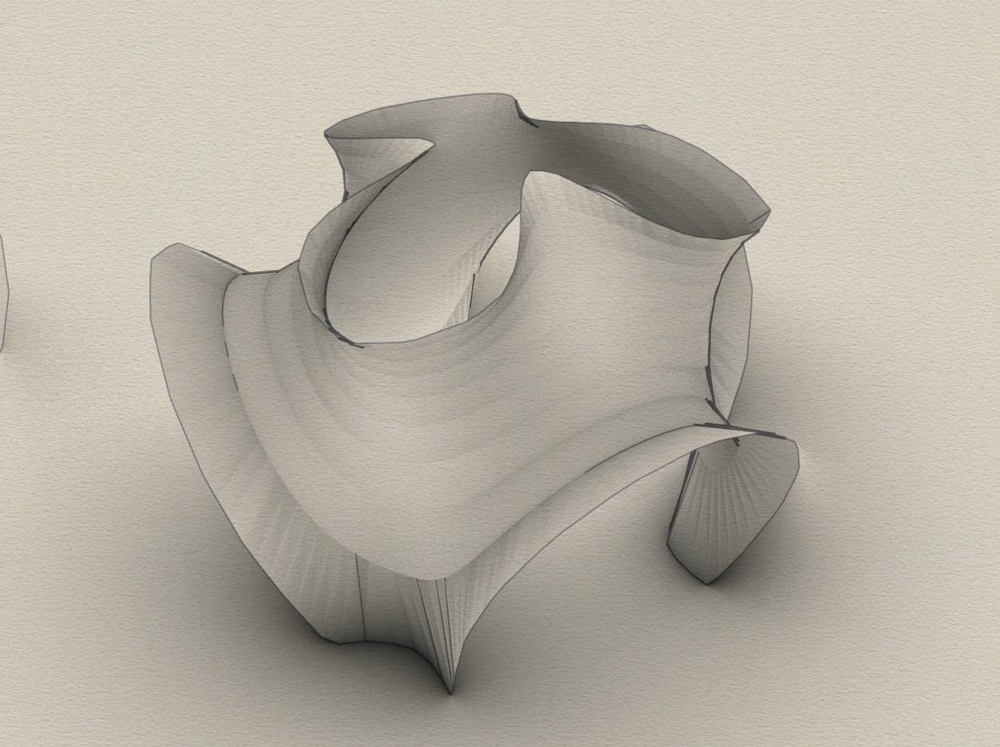

# MinimalSurface
compute an approximate minimal surface without recursion ("in one shot")

This grasshopper component is just another minimal surface solver.
However, unlike most minimal surface solvers, it is not based on physical or iterative principles.
Instead, it computes three harmonic functions of the (u, v) coordinates.
This yields an approximation because minimal surfaces enjoy the property that their three coordinate functions on the surface itself are harmonic.

Thus, we end up with an approximation. The approximation is perfect once the (u, v)-patch is isothermal.

# Installation from the inary releases

    Download [MinSurfacev6.gha](https://github.com/Mathias-Fuchs/MinimalSurface/releases)
    Right-click MinSurfacev6.gha > Properties > unblock
    Drag and drop MinSurfacev6.gha into grasshopper

